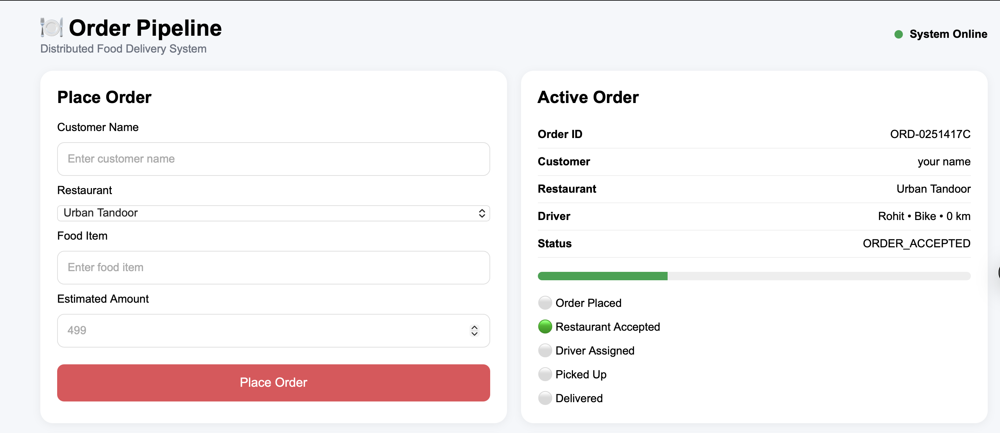
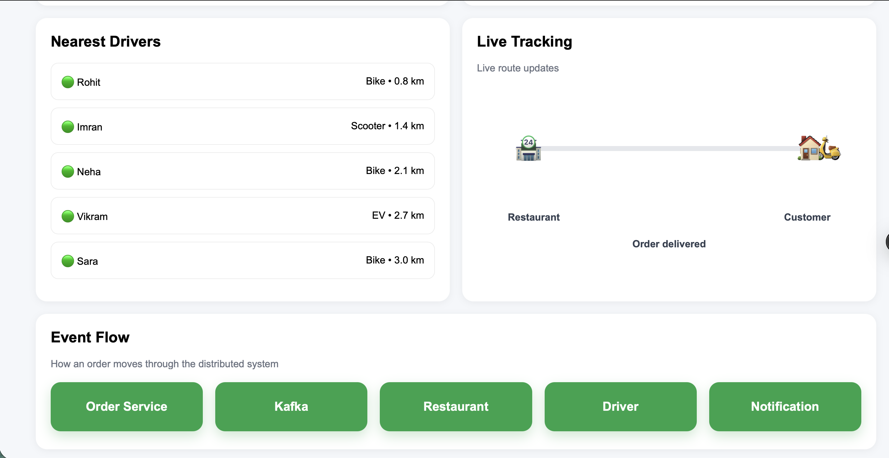

# 🍽️ Real-Time Order Processing System

A real-time food delivery order processing system inspired by platforms like Zomato and Swiggy. The project simulates the complete order lifecycle, including order placement, restaurant acceptance, driver assignment, live tracking, and delivery updates using WebSockets and MongoDB.

## 🌐 Live Demo

**Frontend:** https://real-time-order-processing-system.vercel.app

**Backend:** https://real-time-order-processing-system.onrender.com

---

## 📸 Screenshots

### Dashboard



### Live Tracking



---

## 🎥 Demo Video

https://github.com/user-attachments/assets/4d2a4b4f-927b-4a66-b439-5fcd45e447c7


## ✨ Features

- Place food orders
- Real-time order status updates
- Live delivery tracking
- Automatic driver assignment
- WebSocket-based communication
- MongoDB Atlas integration
- Distributed order processing simulation

---

## 📂 Project Structure

```text
real-time-order-processing-system
│
├── assets
│   ├── dashboard.png
│   └── live-tracking.png
│
├── backend
├── frontend
│
├── README.md
├── package.json
└── .gitignore
```

---

## ⚙️ Run Locally

Clone the repository:

```bash
git clone https://github.com/14Sarthak/real-time-order-processing-system.git
```

Install dependencies:

```bash
npm install
```

Create `backend/.env`:

```env
PORT=4401
MONGO_URI=your_mongodb_uri
CLIENT_ORIGIN=http://127.0.0.1:5500
ORDER_STAGE_DELAY_MS=2500
```

Start the backend:

```bash
npm run dev:backend
```

Open `frontend/index.html` using Live Server.

---
